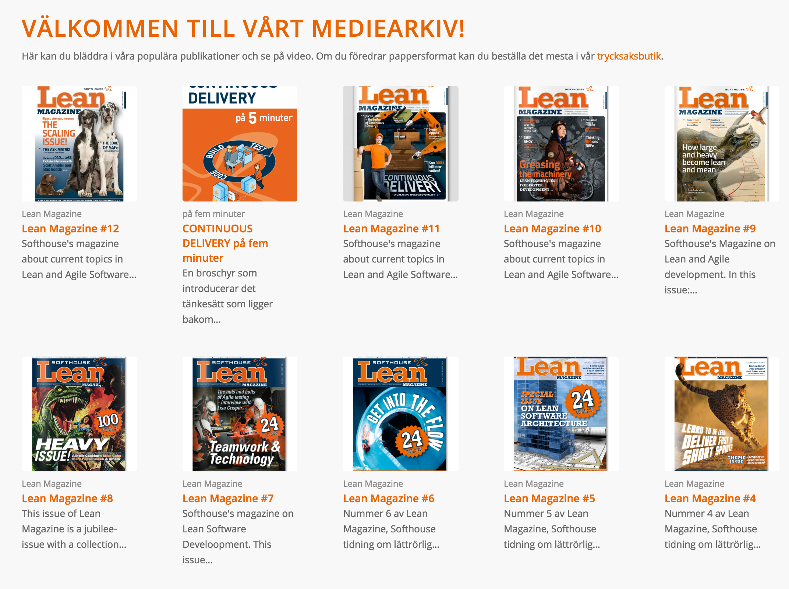
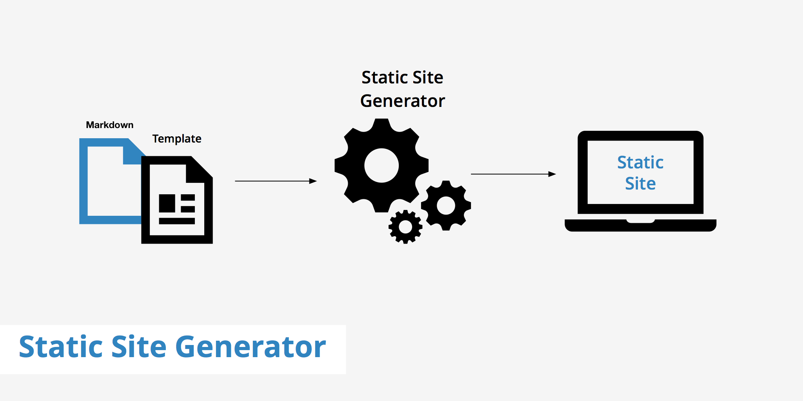
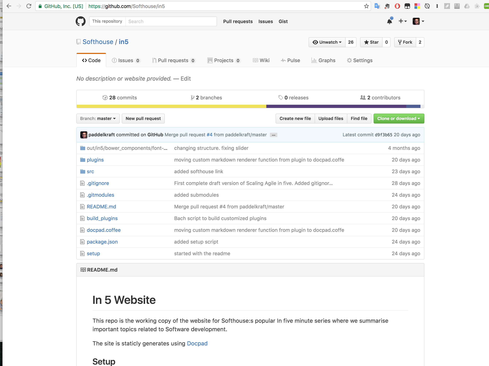
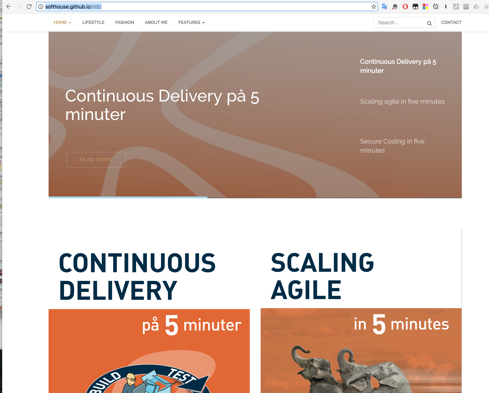

#Content as Code.

---

##Vi på softhouse producerar en massa content!

---

##Pressentations

---

---

# Whats the problem with this content?

---

* No version control
* Content and pressentation together
* Not so collaborative
* Ownership questions
* Not updated
* Low Searchability

---

###Wouldn´t it be great if content could be handled more like code?

---

### Hello Markdown!
    # Hello markdown!
    
    * point1
    * point2
    * point3

    Lorem ipsum dolor sit amet, ut labitur gloriatur eos, nostro definiebas 
    reprimique nec ea. Qui ei illum verear. Mei voluptatum appellantur id, 

    

---

### Hello markdown!

* point1
* point2

Lorem ipsum dolor sit amet, ut labitur gloriatur eos, nostro definiebas 
reprimique nec ea. Qui ei illum verear. Mei voluptatum appellantur id, 
falli forensibus ne eum, sed eu dolores sapientem. At debet disputationi 

---

---

* Cheap/free
* No DB
* Fast as lightning
* Version control content and presentation together
* Secure
* No php

---

## Docpad

A dynamic static site generator based on node.js

---

## github.com

---

## github-pages

---

## in5 get started

    npm install -g docpad@6.78
    npm install -g cake
    git clone https://github.com/Softhouse/in5.git
    ./setup
    docpad run 
    # Open a browser and go to http://localhost:9778/in5/